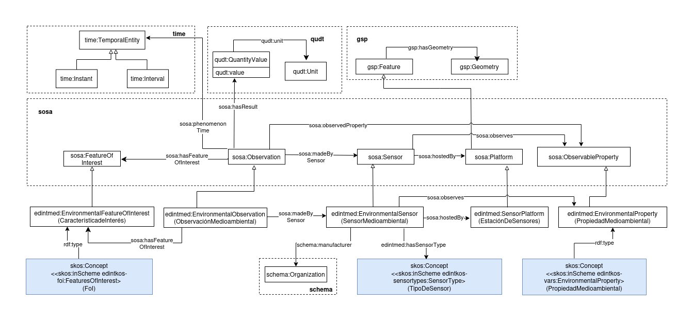

# Ontología EDINT de Sensores Medioambientales (EDINT Environmental Sensors Ontology)

Esta ontología tiene como propósito definir y representar estaciones de medición y sensores medioambientales en el contexto de las ciudades inteligentes y la gestión del medio ambiente. Se ha diseñado como una extensión ligera y modular de la ontología SOSA (Sensor, Observation, Sample, and Actuator) y de GeoSPARQL, restringiendo sus mediciones a vocabularios controlados específicos.

# Propósito y alcance de la ontología (Purpose and scope of the ontology)

Actualmente, existen vocabularios consolidados para la representación de sensores y observaciones (SOSA) y geometrías o localizaciones (GeoSPARQL). Sin embargo, existía la necesidad de un modelo específico para representar de forma unificada infraestructuras de medición física (como cabinas de calidad del aire, boyas acuáticas o torres meteorológicas) y vincular de forma estricta los sensores que albergan con el vocabulario controlado SKOS de EDINT para variables medioambientales. Esta ontología cubre dicho propósito.

# Prefijo y espacio de nombres (Prefix and namespace)

El prefijo de la ontología de *Sensores Medioambientales* es: `edintmed` publicado bajo el espacio de nombres:[http://vocab.linkeddata.es/datosabiertos/def/medioambiente/](http://vocab.linkeddata.es/datosabiertos/def/medioambiente/)

# Modelo conceptual (Ontology conceptualization)

# Estructura del repositorio (Repository structure)

| Carpeta | Descripción |
|--------|--------------|
| **diagrams/**     | Almacena diagramas y otros recursos que representan el modelo conceptual de la ontología (por ejemplo, jerarquías de clases, relaciones).                                     |
| **documentation/**         | Almacena la documentación HTML u orientada a humanos de la ontología y artefactos relacionados.                                                                               |
| **examples/**     | Incluye ejemplos que demuestran cómo instanciar o aplicar la ontología en escenarios de datos reales.                                                                         |
| **kos/**          | Almacena vocabularios controlados o implementación de KOS, generalmente implementaciones SKOS en RDF.                                                                         |
| **ontology/**     | Contiene los archivos de implementación reales de la ontología en formatos como `.owl`, `.rdf`, `.ttl` o `.jsonld`.                                                           |
| **requirements/** | Contiene todos los documentos utilizados para definir los requisitos de la ontología: ejemplos de datos, preguntas de competencia, requisitos funcionales, casos de uso, etc. |
| **shapes/**       | Contiene los SHACL shapes utilizadas para definir y validar las restricciones de la ontología.                                                                                |

# Mantenimiento y evolución (Maintenance and evolution)

Para manejar las incidencias o mejoras sugeridas con respecto a la ontología, recomendamos seguir las guías proporcionadas en ([Issues Management](./ISSUES.md)) para generar una incidencia.

# Financiación (Funding)

Esta ontología ha sido desarrollada en el contexto del Espacio de Datos para las Infraestructuras Urbanas Inteligentes ([EDINT](https://edint.es)).

